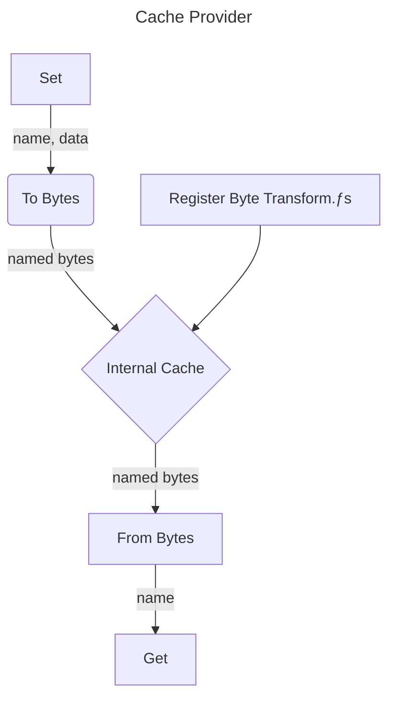
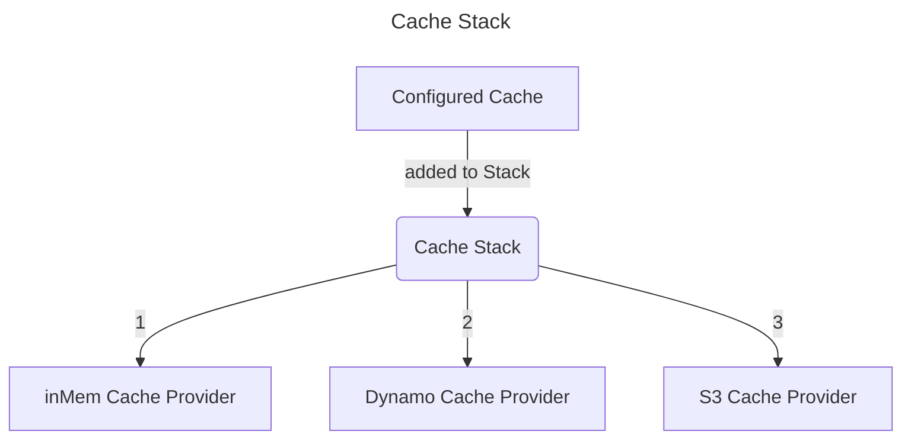

# Overview

```mermaid
---
title: Cache Provider
---

flowchart TD
    Set -->|name, data| Inbound(To Bytes)
    Inbound -->|named bytes| Cache{Internal Cache}
    Register[Register Byte Transform.ƒs] --> Cache{Internal Cache}
    Cache --> |named bytes| Out[From Bytes]
    Out-->|name| Get
    
```

```mermaid
---
title: Cache Stack
---

flowchart TD
    A[Configured Cache] -->|added to Stack| C(Cache Stack)
    C -->|1| D[inMem Cache Provider]
    C -->|2| F[Dynamo Cache Provider]
    C -->|3| E[S3 Cache Provider]
```
