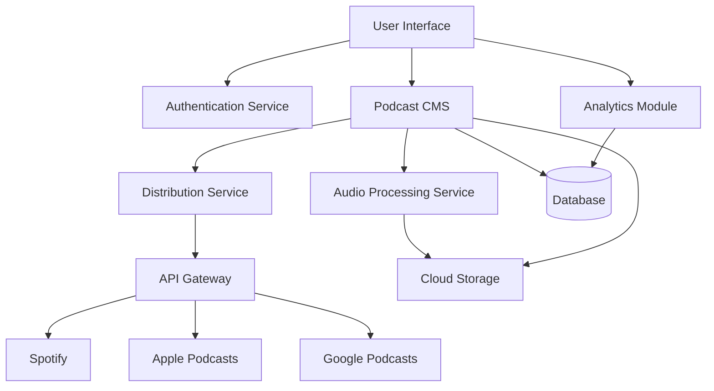
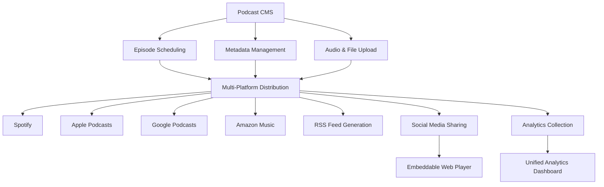
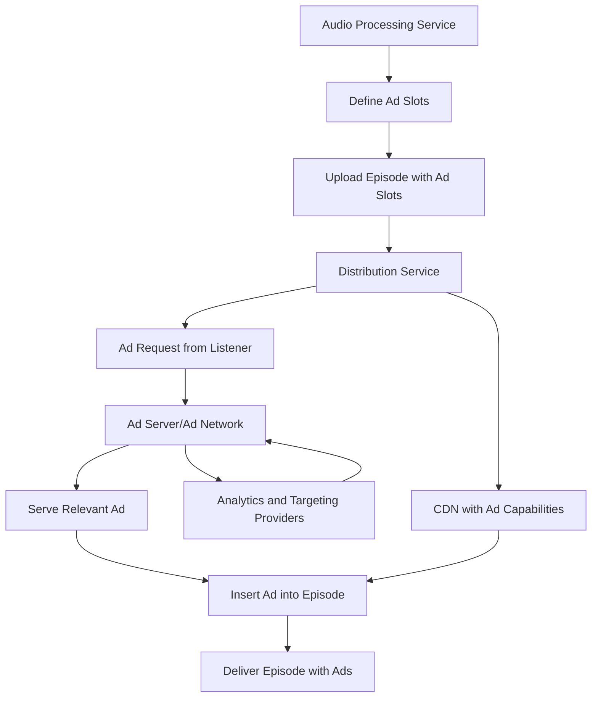
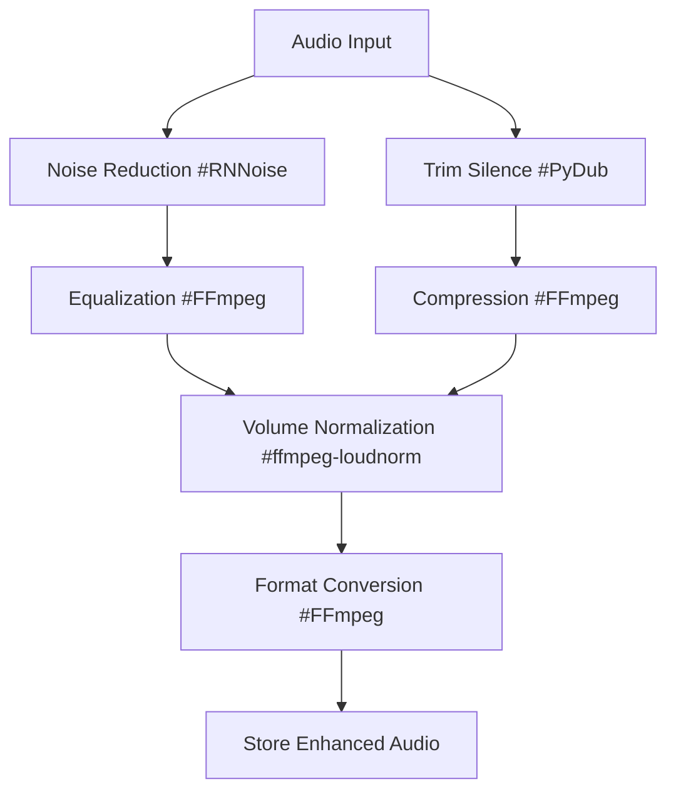

Would prefer a method to load an AST as follows

## Most Basic Usage

```ts
import loadFeed from "AST_THING";
const JSONFEED = loadFeed
	.fromURL("https://www.reddit.com/r/programming/.rss")
	.toJSON();
```

## Parse -> From

> from(s) -<> [use, config, to(s)]

```
.from(AST:AST)
.fromURL(s:string)
.fromJSON(jsonStr : jsonResp )
.fromRSS(jsonStr : jsonResp )
.fromATOM(jsonStr : jsonResp )
.fromCITY(jsonStr : jsonResp )
.fromFeedClass(feedClass: Class, feedData: data )
```

## Stringify -> To

> to(s) -> Promise.resolve()

```
.toCITY() // {string, feed:AST, messages: {}[], warnings: {}[]}
.toRSS() // rss XML string
.toATOM() // atom XML string
.toJSON() // JSON feed string
.toAST() // JSON feed string
.toFeedType( templ: string | Function) // provide a template function or mustache template string
```

## USE Middleware

> use -<> [use, config, to(s) ] config -<> [use, config, to(s) ]

```
.config() // optional
.data() // optional

.use(enhancementFnURL: string) // returns an ASTshell?
.use(enhancementFn:enhancementFn)
.use(enhancementFn:enhancementFn, options:options)
.using(enhancemenFnArr :(enhancementFn | string)[], options:unknown[])
```

## Final

```
.exportConfig()
```

_#Messages_ & _#Warnings_

> both use the SCIPAB interface

```ts
Interface SCIPAB {
    from: string // FeedFunc
    location: string // DataLocation
    situation: string //  (what happened)
    complication: string // (why its a problem)
    implication: string // (why you might care)
    action: string // (what we did to help you)
    benefit: string // (hopefully you like it - because)
}
```





The **Audio Processing Service** in your podcast middleware could offer a range of automated or semi-automated features to enhance podcast production, particularly for podcasters who may not have advanced technical skills or access to expensive editing software. Here are some key functions it might include:

### 1. **Audio Editing Automation**
   - **Noise Reduction**: Automatically removes background noise, static, or hum from recordings to improve audio quality.
   - **Volume Normalization**: Ensures consistent volume levels across episodes or even within a single episode, so that all speakers are at similar loudness levels.
   - **Trimming Silence**: Detects and removes long pauses or dead air from recordings, helping to keep episodes more engaging.

### 2. **Ad Insertion**
   - **Dynamic Ad Insertion**: Allows podcasters to mark points in their episodes where ads can be inserted dynamically, with the ability to change ads over time without altering the original audio.
   - **Targeted Ads**: Integrates with the analytics service to insert ads tailored to the listener's profile, such as location or preferences.
   - **Pre-roll, Mid-roll, Post-roll Ads**: Enables automatic insertion of ads at the beginning, middle, or end of an episode.

### 3. **Audio Enhancements**
   - **Equalization (EQ)**: Automatically adjusts frequency levels (e.g., boosting bass or reducing treble) to improve overall sound balance.
   - **Compression**: Balances the dynamic range of the audio by reducing the difference between the quietest and loudest parts, making for a smoother listening experience.
   - **Audio Effects**: Provides optional effects such as reverb, echo, or voice modulation for creative podcasting.

### 4. **Transcoding and Format Conversion**
   - **Format Conversion**: Automatically converts audio files into different formats (MP3, AAC, WAV, etc.) based on the podcast platform's requirements.
   - **Bitrate Optimization**: Adjusts audio quality based on the platform or listener’s network conditions (e.g., higher bitrate for high-quality downloads, lower bitrate for streaming).

### 5. **Episode Segmentation**
   - **Automatic Segmentation**: Splits long recordings into multiple episodes or segments, which is useful for podcasters who record in bulk or create series-based content.
   - **Chapters & Timestamps**: Automatically inserts chapters into long episodes, making it easier for listeners to jump to different sections.

### 6. **Audio-to-Text Transcription**
   - **Transcription for Accessibility**: Converts audio into text for use as episode show notes, blog posts, or to meet accessibility requirements.
   - **Searchable Transcripts**: Makes it easier for listeners to search for specific content within an episode.

### 7. **Multi-Track Editing**
   - **Track Separation**: Automatically separates individual speakers (if recorded on different tracks) and allows for adjustments to each track (e.g., volume, effects) separately.
   - **Track Syncing**: Syncs multiple audio tracks to avoid time drift or mismatch in longer recordings with multiple participants.

### 8. **Quality Control Checks**
   - **Audio Integrity**: Automatically checks for audio issues like clipping, distortion, or sudden volume drops, and flags them for the podcaster to review.
   - **Loudness Compliance**: Ensures that the final audio meets platform-specific loudness requirements (e.g., LUFS for Spotify).

### 9. **Automated Intro/Outro Insertion**
   - **Intro/Outro Management**: Automatically inserts pre-recorded intros or outros at the appropriate points, ensuring consistency across episodes.
   - **Customizable Templates**: Allows podcasters to set templates for inserting intro/outro music or voiceovers.

---

### Mermaid Diagram for Audio Processing Service

We can depict the Audio Processing Service's internal workflow as follows:

```mermaid
graph LR;
    Input[Podcast Audio Input] --> soundProc
        subgraph soundProc [Sound Processing]
            direction TB
            NoiseReduce[Noise Reduction] --> TrimSilence[Silence Trimming]
            TrimSilence --> VolNorm[Volume Normalization]
            VolNorm --> EQ[Equalization]
            EQ --> Compression
        end
    Compression --> FinalInput[Enhanced Submitted Audio]
    
        subgraph ads [Ad Processing]
            direction LR
            FinalInput --> Ads[Ad Insertion]
            Ads --> FinalOutput[Final Processed Episode]
            FinalOutput --> Transcode[Format Conversion]
        end
    Transcode --> Storage[Cloud Storage]

    Storage --> Distribution[Pulled for Distribution]
```



### Explanation of Workflow:
- **Audio Enhancement (Noise Reduction, Normalization)**: These processes run first to clean up the audio and ensure consistent quality.
- **Dynamic Ad Insertion**: Once the audio has been processed, ads can be dynamically inserted based on predefined ad slots.
- **Format Conversion**: The final audio is converted to the appropriate format for distribution, then stored for easy access by the distribution service.

---

### Key Considerations:
- **Automation vs. Manual Control**: Will users have the option to control the level of automation, or will most processes run in the background automatically?
- **Customization**: How customizable will these features be? For example, will users be able to tweak audio settings, or will everything be preset?
- **Real-time Processing**: Depending on user needs, real-time processing might be valuable for live or near-live podcast episodes.


The **Distribution Service** in your podcast middleware plays a key role in ensuring your podcast episodes are efficiently shared across multiple platforms and can reach a wide audience. This service should streamline the process of distributing content to various podcast directories and platforms, handle scheduling, and manage episode metadata. Here's a breakdown of the features and functionalities it might offer:

### Key Features of the Distribution Service

#### 1. **Multi-Platform Distribution**
   - **One-Click Publishing**: Enables podcasters to publish an episode across multiple platforms (e.g., Spotify, Apple Podcasts, Google Podcasts, Amazon Music) with a single action.
   - **Platform-Specific Formatting**: Automatically adjusts the episode's format (audio format, metadata, etc.) to meet the requirements of each platform.
   - **RSS Feed Generation**: Provides a custom RSS feed that can be submitted to various podcast directories.
   - **Platform Integration**: Integrates directly with popular platforms through APIs for seamless uploading and updating of episodes.
   
#### 2. **Scheduled Distribution**
   - **Episode Scheduling**: Allows podcasters to schedule episodes to be published at specific dates and times across multiple platforms.
   - **Timezone Adjustments**: Automatically accounts for timezone differences, ensuring episodes go live simultaneously across all platforms, regardless of geographical location.
   
#### 3. **Episode Metadata Management**
   - **Automated Metadata Population**: Fills in required metadata fields (title, description, episode number, show notes, etc.) using templates or data from the CMS.
   - **Custom Metadata for Each Platform**: Provides the option to tailor metadata for specific platforms (e.g., different descriptions or categories).
   - **Transcript and Show Notes Distribution**: Includes transcriptions, show notes, and other episode-related text that can be distributed with the audio file.
   
#### 4. **Dynamic Content Updates**
   - **Episode Updates Across Platforms**: Allows users to make edits to episode metadata, audio files, or artwork, and automatically push these updates to all connected platforms.
   - **Dynamic Ad Updates**: Works with the **Audio Processing Service** to enable real-time updating of dynamically inserted ads without needing to republish the entire episode.
   
#### 5. **Analytics Integration**
   - **Cross-Platform Analytics Collection**: Collects data from each platform regarding downloads, listens, and listener demographics. Provides a unified dashboard in the middleware to display insights.
   - **API Access for Analytics**: Provides an API to access data from third-party analytics tools (e.g., Podtrac, Chartable) and aggregate it into one place.
   
#### 6. **Version Control & Archiving**
   - **Episode Versioning**: Tracks changes made to an episode over time, allowing users to roll back to previous versions if necessary.
   - **Episode Archiving**: Automatically archives episodes after a certain period, retaining them in the middleware even if removed from external platforms.

#### 7. **Monetization and Sponsorship Distribution**
   - **Monetization Integrations**: Works with external monetization services (e.g., Patreon, Acast) to automatically distribute premium or paid content to subscribers.
   - **Subscription-Based Content**: Distributes exclusive content to specific platforms or premium subscribers, based on listener subscription tiers.
   - **Sponsorship Tagging**: Allows users to tag sponsored episodes and report back to sponsors regarding listenership metrics (via analytics integration).
   
#### 8. **Social Media & Website Integration**
   - **Automatic Sharing to Social Platforms**: Automatically shares episode links and snippets to social platforms like Twitter, Instagram, and Facebook once an episode goes live.
   - **Embeddable Player**: Provides an embeddable web player that users can place on their websites, allowing listeners to stream directly without going to third-party platforms.

#### 9. **Content Localization**
   - **Language-Specific Feeds**: Creates language-specific RSS feeds or metadata for platforms that support multiple languages.
   - **Geofencing**: Limits episode distribution to specific regions or countries if needed for licensing or localization reasons.

#### 10. **Compliance and Legal**
   - **Copyright Management**: Ensures episodes comply with copyright laws on different platforms by verifying metadata (e.g., song credits, guest permissions).
   - **Platform Compliance**: Automatically checks episodes for adherence to platform-specific policies (e.g., Apple’s guidelines for episode artwork or explicit content warnings).

### Mermaid Diagram of the Distribution Service

Here’s a high-level view of how the Distribution Service might interact with other components in your podcast middleware.



### Explanation of Workflow:
- **Podcast CMS**: Manages the episodes, including audio files and metadata.
- **Scheduling**: Allows podcasters to schedule the release of episodes.
- **Multi-Platform Distribution**: Distributes the content across various platforms like Spotify, Apple Podcasts, and Google Podcasts.
- **RSS Feed Generation**: Automatically creates and updates an RSS feed for wider distribution.
- **Analytics Collection**: Gathers data from each platform and provides insights via a unified dashboard.
- **Social Media Sharing**: Automatically shares new episodes on social media and provides an embeddable player for websites.

### Additional Considerations:
- **API Integrations**: Will the service offer APIs to integrate with external analytics and ad networks for real-time ad performance tracking?
- **Dynamic Content**: Will you offer the ability to swap content post-distribution (e.g., updating ads or replacing segments)?
- **Geographical Targeting**: Are there any plans for geo-targeting to manage where and how content is released based on user preferences or regional legalities?


Dynamic ad insertion (DAI) is a key feature that allows you to insert, replace, or rotate ads within podcast episodes after they've been published. This can happen either in real-time when an episode is requested (on-demand) or as part of the audio processing workflow before distribution. The DAI system typically interacts with several external systems, including ad networks, analytics providers, and content distribution platforms.

### Where Dynamic Ad Insertion Would Happen:

The **Dynamic Ad Insertion (DAI)** process can be placed in two main areas within your architecture:

1. **During Audio Processing (Pre-distribution)**:
   - Ads are inserted as part of the **Audio Processing Service** before the episode is distributed. This is useful for planned, static ad placements.
   - This approach would involve predefining ad slots and filling them with ad content that is added to the episode’s audio file before uploading it to the Distribution Service.
   
2. **At the Time of Distribution (Real-Time)**:
   - Ads are dynamically inserted when a listener requests the episode from a podcast platform. This involves the **Distribution Service** interacting with an ad server that serves the appropriate ad based on user demographics, geolocation, or device type.
   - This approach allows for personalized or regionalized ads and keeps ads fresh over time (e.g., rotating sponsors).

### External Systems and Providers Connected to DAI:

Here are the key external systems and providers that might be connected to the DAI sub-system:

#### 1. **Ad Servers and Ad Networks**
   - **Google Ads (AdSense for Audio/Podcasting)**: Can provide targeted audio ads based on listener preferences and demographics.
   - **Acast**: Offers dynamic ad insertion with real-time bidding for audio ads and is commonly used by podcasters for monetization.
   - **Megaphone**: Another leading platform that offers real-time ad insertion, usually integrated with larger podcast networks.
   - **Spotify Ad Studio**: Especially useful if you’re distributing to Spotify, which allows ad targeting based on listener behavior and demographics.

#### 2. **Ad Exchange Platforms**
   - **Adswizz**: A prominent digital audio ad exchange platform. It allows you to place programmatic ads into podcast streams dynamically.
   - **Triton Digital**: Another large ad exchange and audio marketplace that integrates with podcast platforms to deliver ads in real-time.
   
#### 3. **Content Delivery Networks (CDN)**
   - **Akamai**: A CDN that can deliver podcast episodes, with integrated support for dynamic ad insertion. The CDN would cache episodes but serve ads dynamically depending on the listener’s profile.
   - **Amazon CloudFront**: If you're using Amazon Web Services (AWS), you could use CloudFront to deliver podcast episodes with dynamic ads injected based on listener requests.

#### 4. **Analytics & Targeting Providers**
   - **Chartable**: Provides analytics around downloads and audience demographics, which could be used for ad targeting. Chartable integrates with several ad networks to help provide data for optimized ad placement.
   - **Podtrac**: A podcast analytics provider that can measure audience size, location, and other data. It integrates with ad platforms to ensure that ads are reaching the right audiences.
   - **Nielsen**: Nielsen's podcasting services help with audience measurement, providing deeper insights into listener behavior for more targeted ad placements.

#### 5. **Podcast Platforms with Native DAI Capabilities**
   - **Spotify**: Offers its own DAI system through its platform, which can dynamically inject ads for its users based on their profiles and listening behavior.
   - **Apple Podcasts**: While Apple currently doesn’t have a dynamic ad insertion feature, third-party systems like Megaphone or Adswizz can work around this by delivering ads before uploading episodes to Apple Podcasts.

### Dynamic Ad Insertion Workflow

Here’s how the **Dynamic Ad Insertion** could work, incorporating external systems:



### Explanation of the Workflow:
1. **Audio Processing**: In the **Audio Processing Service**, ad slots are defined during production (e.g., 10 minutes into the episode for a mid-roll ad).
2. **Upload Episode**: The episode is uploaded with placeholders (ad slots) where ads will be dynamically inserted later.
3. **Listener Requests**: When a listener requests an episode through a platform (e.g., Spotify), the **Distribution Service** sends an ad request to an external ad server (like Acast or Megaphone).
4. **Ad Server**: The ad server delivers an ad based on listener data (demographics, location, behavior).
5. **Insert Ad**: The ad is inserted dynamically into the episode audio, either on-the-fly or via the CDN, and the final episode with the ad is delivered to the listener.
6. **Analytics Integration**: During this process, data about the listener (e.g., whether they completed the episode, the number of impressions) is sent to analytics providers like Chartable or Nielsen. This data helps improve future ad targeting.

### Benefits of Dynamic Ad Insertion:
- **Personalization**: Ads can be tailored to individual listeners based on location, interests, or demographics.
- **Freshness**: Ads can be updated over time without republishing the episode.
- **Revenue Maximization**: Real-time bidding systems can serve ads at higher prices when demand is high.


When building the **Audio Processing Service** for your podcast middleware, leveraging open-source libraries for audio enhancements can greatly reduce development time while providing powerful functionality. Here are some common open-source libraries that can be used for various audio enhancement tasks, such as noise reduction, normalization, equalization, and more.

### 1. **Noise Reduction**
   - **[RNNoise](https://github.com/xiph/rnnoise)**: 
     - RNNoise is a powerful noise reduction library based on deep learning. It’s designed for real-time noise suppression, making it ideal for cleaning up podcast audio with minimal configuration.
   - **[SoX (Sound eXchange)](http://sox.sourceforge.net/)**:
     - SoX is a command-line utility that can apply a variety of audio effects, including noise reduction. It is versatile and works across platforms, supporting a wide range of audio formats.

### 2. **Volume Normalization**
   - **[ffmpeg](https://ffmpeg.org/)**:
     - FFmpeg is one of the most versatile libraries for audio and video processing. It offers a wide range of audio normalization techniques such as the `loudnorm` filter, which helps ensure consistent volume levels across your episodes.
   - **[loudness-normalization](https://github.com/csteinmetz1/loudness-normalization)**:
     - This is a Python-based library for loudness normalization compliant with international standards (e.g., EBU R128). It can be useful for ensuring that your podcasts have consistent volume across different platforms.

### 3. **Equalization (EQ)**
   - **[Vamp Plugins](http://vamp-plugins.org/)**:
     - Vamp Plugins offer a range of audio processing capabilities, including equalization. These plugins can be integrated into many audio processing frameworks to add customizable EQ settings to podcast audio.
   - **[JUCE](https://juce.com/)**:
     - JUCE is an open-source C++ library used for developing audio applications. It includes a built-in equalizer module that can be used for real-time or offline equalization, giving you full control over audio frequency bands.

### 4. **Audio Compression**
   - **[libav](https://libav.org/)**:
     - Similar to FFmpeg, Libav provides libraries and tools to manipulate multimedia content. Its `audiocompress` filter can help reduce dynamic range, making quiet parts louder and loud parts quieter, a key aspect of audio compression.
   - **[SpeexDSP](https://github.com/xiph/speexdsp)**:
     - A real-time audio processing library that includes functions for audio compression and echo cancellation. It’s lightweight and often used in VoIP applications but can also enhance podcast audio quality.

### 5. **Audio-to-Text Transcription (Speech-to-Text)**
   - **[Mozilla DeepSpeech](https://github.com/mozilla/DeepSpeech)**:
     - DeepSpeech is a state-of-the-art speech-to-text library that can be used for converting podcast audio into transcripts. This is useful for accessibility and creating searchable podcast content.
   - **[Kaldi](https://github.com/kaldi-asr/kaldi)**:
     - Kaldi is a flexible and powerful speech recognition toolkit. It is widely used in academia and industry for transcription tasks and can be adapted for podcast transcription.

### 6. **Trimming Silence**
   - **[PyDub](https://github.com/jiaaro/pydub)**:
     - PyDub is a Python-based library for simple and effective audio manipulation. It can detect and remove long periods of silence from audio files, a common task for cleaning up podcasts.
   - **[SoX (Sound eXchange)](http://sox.sourceforge.net/)**:
     - SoX also provides utilities for detecting and trimming silence from audio files. It allows you to specify the minimum silence length and threshold for trimming.

### 7. **Format Conversion (Transcoding)**
   - **[FFmpeg](https://ffmpeg.org/)**:
     - FFmpeg is the go-to tool for audio format conversion. It supports nearly every format (MP3, AAC, WAV, FLAC, etc.) and can also handle bitrate adjustments for podcast audio to optimize file size and quality.
   - **[GStreamer](https://gstreamer.freedesktop.org/)**:
     - GStreamer is a multimedia framework that allows you to create pipelines for handling audio format conversions. It’s useful when you need to integrate audio transcoding into a more complex processing pipeline.

### 8. **Audio Effects**
   - **[LADSPA (Linux Audio Developer's Simple Plugin API)](http://www.ladspa.org/)**:
     - LADSPA offers a range of audio effects such as reverb, echo, and equalization. It’s a plugin architecture for Linux-based systems but can be adapted for other environments.
   - **[Sonic Pi](https://sonic-pi.net/)**:
     - While Sonic Pi is more focused on live coding music, it provides interesting sound manipulation features such as time-warping and custom audio effects that could be useful for creative podcast production.

### 9. **Multi-Track Editing**
   - **[Audacity](https://www.audacityteam.org/)**:
     - Audacity is a popular open-source audio editor that offers multi-track editing. While it’s usually used as a standalone application, Audacity can be automated through scripting to handle tasks such as track syncing and editing.
   - **[Ardour](https://ardour.org/)**:
     - Ardour is a professional-grade digital audio workstation (DAW) that supports multi-track editing, making it ideal for podcasts with multiple speakers or soundtracks. You can build automation workflows using Ardour’s powerful scripting capabilities.

### 10. **Loudness Compliance**
   - **[ffmpeg’s `loudnorm`](https://ffmpeg.org/)**:
     - FFmpeg’s `loudnorm` filter provides loudness normalization that complies with standards like EBU R128, ensuring that your podcasts meet platform loudness requirements (e.g., Spotify or Apple Podcasts).
   - **[LUFS Meter (Loudness Units Full Scale)](https://github.com/jiixyj/loudness-meter)**:
     - LUFS Meter is a tool that helps measure and normalize audio loudness. It’s useful for ensuring your podcast’s audio complies with broadcasting standards.

---

### Sample Audio Processing Workflow Using Open-Source Libraries:



### Explanation of Workflow:
1. **Noise Reduction**: Audio files are processed with RNNoise to clean up background noise.
2. **Trimming Silence**: PyDub is used to trim long periods of silence.
3. **Equalization**: FFmpeg adjusts the frequency balance using EQ filters.
4. **Compression**: FFmpeg compresses the dynamic range to make quieter parts louder and loud parts softer.
5. **Normalization**: The audio is normalized using FFmpeg’s `loudnorm` filter to ensure consistent volume.
6. **Format Conversion**: The processed audio is converted into the desired output format (e.g., MP3, AAC) using FFmpeg.

By leveraging these open-source libraries, you can build a robust and flexible **Audio Processing Service** with minimal cost. Would you like to explore how to implement any of these in more detail or integrate them into your architecture?